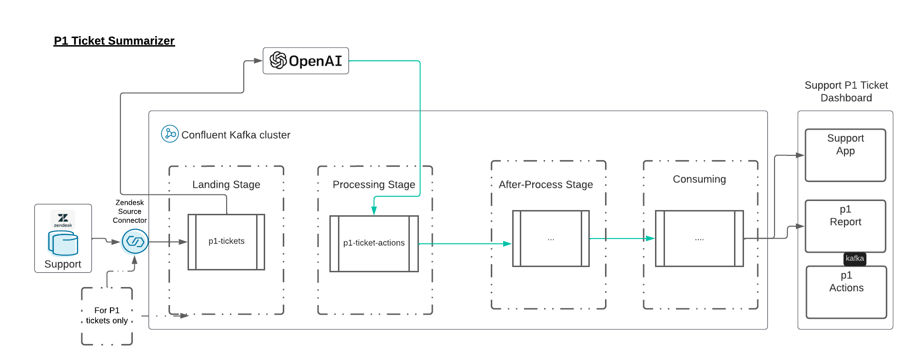
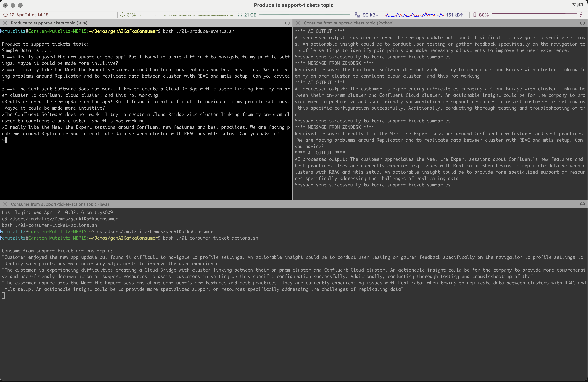
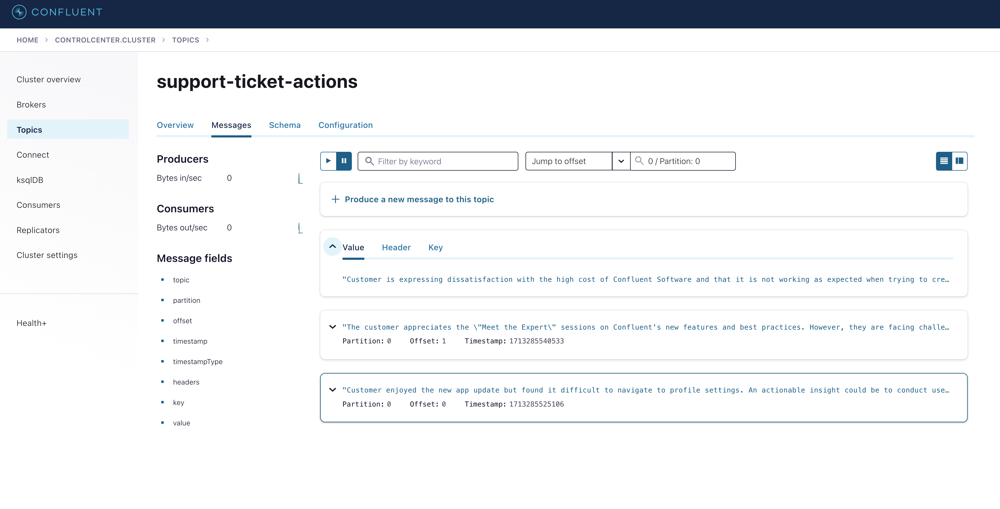

# Generic and simple generative AI sample with Confluent the `genAIKafkaConsumer` APP

This is a pretty nice and simple demo written in Python. I am using [LLM Langchain Python Lib](https://python.langchain.com/docs/modules/model_io/llms/).
The use case is also pretty nice. I run a [Zendesk Sourcer Connector](https://docs.confluent.io/kafka-connectors/zendesk/current/overview.html) and ingest P1 support tickets into Confluent Platform cluster. I route this ticket to chatgpt API and ask for formulate actions out of this ticket and route it directly to the P1 Dashboard and Support Engineers.

The prompt is very easy and straight forward: `Summarize this customer feedback and suggest an actionable insight`


The Zendesk Connector is simulated with a simple Kafka producer. I put three sample Tickets into the producer client:

* 1 ==> Really enjoyed the new update on the app! But I found it a bit difficult to navigate to my profile settings. Maybe it could be made more intuitive?
* 2 ==> I really like the Meet the Expert sessions around Confluent new features and best practices. We are facing problems around Replicator and to replicate data between cluster with RBAC and mtls setup. Can you advice?
* 3 ==> The Confluent Software does not work. I try to create a Cloud Bridge with cluster linking from my on-prem cluster to confluent cloud cluster, and this not working.

Take them and produce it to `support-tickets` topic or use your own ideas. Based on this tickets openAI is doing a summary and suggest an actionable insight.

As you will see this is really pretty easy and brings much value.

## Starting the Demo.

pre-reqs:

* confluent cli installed
* running Java at least 1.8 (till CP 8.0 is it supported) or newer
* Confluent Platform 7.6. or newer installed
* Python3 with following packages installed: kafka and openai
* iterm installed (if not installed run the scripts manually)
* I run on INTEL MacOS
* Having an Open AI Api Key. If not, create an OpenAI API Key (follow [open AI Account setup](https://platform.openai.com/docs/quickstart/account-setup?context=python))

copy the OpenAI Key to `env-vars` file:

```Bash
at > $PWD/env-vars <<EOF
export OPENAI_API_KEY=YOUR openAI Key
EOF
```

Start the demo by executing:

```bash
./00_start_genAIKafkaConsumerDemo.sh
```

This will open iterm. Now, you can play around and produce some messages and see what openAI will generate.


The results will then produce into the topic `support-ticket-actions`. see Control Center Screenshot:



## Stop Demo and Delete

just run this script. This will drop topics, stop local CP and destroy lokal CP:

```bash
./02_stop_genAIKafkaConsumerDemo.sh
````

END