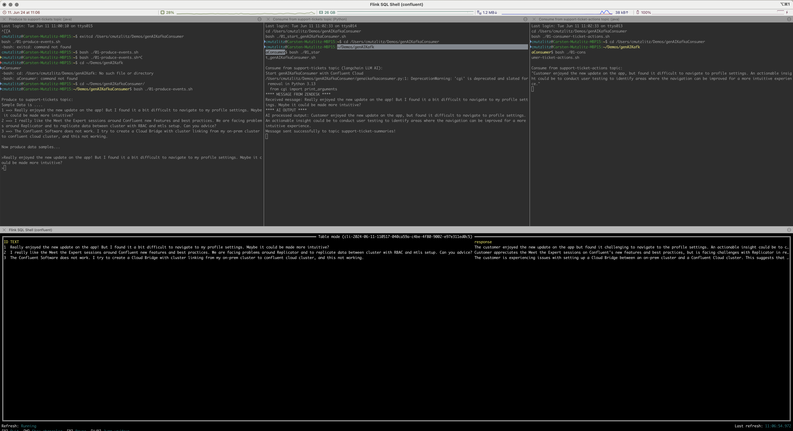

# Generic and simple generative AI sample with Confluent: Say hello to the `genAIKafkaConsumer` APP

This is another demo app around generative AI and Confluent. The demo is pretty nice, easy to read and simple demo written in Python.
Generative AI and Confluent/Apache Kafka are powerful technologies that, when combined, can revolutionize data-driven industries by enhancing real-time data processing with intelligent, automated insights. 

The use case is also pretty nice. We have a need to combine real-time, because they are highly critical, with the power of genAI to fasten the process. We run a [Zendesk Sourcer Connector](https://docs.confluent.io/kafka-connectors/zendesk/current/overview.html) and ingest P1 support tickets into Confluent Platform cluster. We route this ticket to openAI API and ask for formulate actions out of this ticket and route it directly to the P1 Dashboard and Support Engineers. This amazing and simple value add brings much benefits into the P1 ticket handling.

The prompt is very easy and straight forward: `Summarize this customer ticket feedback and suggest an actionable insight`.
The next image show the demo architecture. 


The Zendesk Connector is simulated with a simple Kafka producer. I put three sample Tickets into the producer client:

* 1 ==> Really enjoyed the new update on the app! But I found it a bit difficult to navigate to my profile settings. Maybe it could be made more intuitive?
* 2 ==> I really like the Meet the Expert sessions around Confluent new features and best practices. We are facing problems around Replicator and to replicate data between cluster with RBAC and mtls setup. Can you advice?
* 3 ==> The Confluent Software does not work. I try to create a Cloud Bridge with cluster linking from my on-prem cluster to confluent cloud cluster, and this not working.

Take them and produce each message to `support-tickets` topic or use your own ideas. Based on this ticket content openAI is doing a summary and suggest an actionable insight.

As you will see this is really pretty easy and brings much value.

## Starting the Demo.

prerequisite:

* confluent cli must be installed
* running Java at least version 1.8 (till CP 8.0 JDK 1.8 is supported) or newer
* If you would like run with Confluent Platform
    * Confluent Platform 7.6. or newer installed
* If you would like to run with Confluent Cloud you need a working Confluent Cloud account 
* Python3 with following packages installed: kafka and openai
* iterm2 installed (if not installed, run the scripts manually, check script `01_terminals.scpt`)
* I run on INTEL MacOS
* Having an OpenAI Api Key. If not, create an OpenAI API Key (follow [open AI Account setup](https://platform.openai.com/docs/quickstart/account-setup?context=python))

copy the OpenAI Key to `env-vars` file:

```Bash
at > $PWD/env-vars <<EOF
export OPENAI_API_KEY=YOUR openAI Key
export ENVIRONMENTNAME=cmgenai
EOF
```

Start the demo for Confluent Platform setup by executing:

```bash
./00_start_genAIKafkaConsumerDemo.sh CP
```

Start the demo for Confluent Cloud setup by executing:

```bash
./00_start_genAIKafkaConsumerDemo.sh CC
```


This will open iterm. You can now play around and produce some messages and see what openAI will generate.


* First Window Session: The Zendesk Ticket producer: Copy text and press enter
* Second Window Session: Show the genAIKafkaConsumer in action
* Third Window Session: A consumer on topic support.ticket-actions will show what openAI did generate

All results will then produce into the topic `support-ticket-actions`. see Control Center Screenshot:


If you run Confluent Cloud and your Confluent Cloud Org is enabled for [Flink AI Models Early Access](https://staging-docs-independent.confluent.io/docs-cloud/PR/3796/current/flink/reference/statements/create-model.html#examples) then a Flink SQL Pool, a Table with 3 records were created.
Open a Flink Shell, and try to use OpenAI direct in your stream processing:

```bash
confluent flink shell --compute-pool $FPOOLID --database $CLUSTERID --environment $ENVID
> select * from support_tickets_flink limit 3;
> SET 'sql.secrets.my_api_key' = 'set your OPENAI KEY';
> CREATE MODEL cmgenai_openai_model INPUT(prompt STRING) OUTPUT(response STRING) COMMENT 'cmgenai-openai' WITH ('task' = 'text_generation','provider'='openai','openai.endpoint'='https://api.openai.com/v1/chat/completions','openai.api_key'='{{sessionconfig/sql.secrets.my_api_key}}','openai.system_prompt'='Summarize this customer feedback and suggest an actionable insight');
> describe model cmgenai_openai_model;
# Start GENAI
> SELECT ID, TEXT, response FROM support_tickets_flink, LATERAL TABLE(ML_PREDICT('cmgenai_openai_model', TEXT));"
> quit
```

With Flink SQL AI we will have a four session terminal:


## Stop Demo and Delete

First exit all open session in iterm.
Just run the next script. This will drop topics, stop local CP and destroy local CP:

```bash
./02_stop_genAIKafkaConsumerDemo.sh
```
The terminal sessions need to be stopped (CTRL+c) manually.

# Troubleshooting

## openAI could not imported

Solution: Uninstall and install it again.

```bash
pip3 uninstall openai
pip3 install openai
```

END
